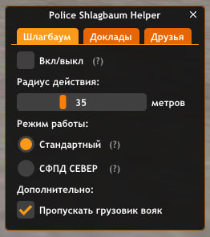
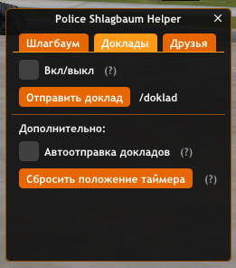
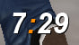
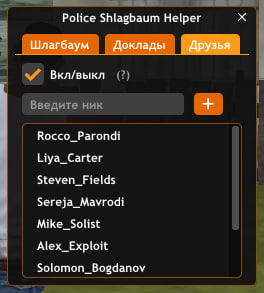
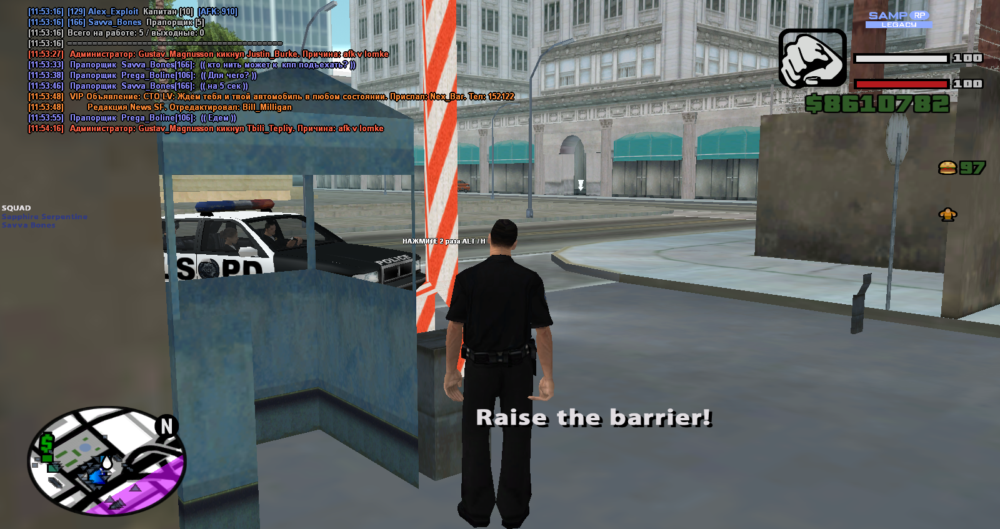

# 👮 Police Shlagbaum Helper
Скрипт для улучшения игры на посту КПП на ***Samp-Rp***
- Открытие меню скрипта: `/kpp`
## 🚔 Вкладка "Шлагбаум"

1. Вкл/выкл Автооткрытия шлагбаума.
> Автооткрытие срабатывает по такому принципу: если в заданном радиусе есть скин полицейского, и он находится в движущейся машине, то два раза жмется альт, в результате чего открывается шлагбаум. 
>> Скрипт не сработает если полицейский находится ниже 4 метров и выше 4 метров по высоте относительно Вас.
2. Настраиваемый радиус срабатывания.
3. Два режима работы.
> Стандартный подходит для постов КПП ЛСПД, ЛВПД, СФПД ЮГ. Второй режим нужен для КПП СФПД со стороны севера. Так как этот КПП находится довольно высоко, то у режима СФПД СЕВЕР граница срабатывания вниз увеличена до 12 метров, тоесть при стандартном режиме, если машина будет ехать со стороны гаража к КПП, то скрипт сработает поздно, а при втором режиме вовремя.

## 📻 Вкладка "Доклады"

- `Вкл/выкл таймера.` Нужен чтобы знать, когда отправить следующий доклад.
- Отправка докладов кнопкой, либо командой `/doklad`.
> Доклады в /r отправляются в таком формате: `Пост: КПП. Состав: "Количество копов на ногах в радиусе 10 метров с учетом игрока". Состояние: Спокойное.` ***Например***, в радиусе 10 метров есть еще один коп кроме нас, тогда доклад будет выглядить так: `Пост: КПП. Состав: 2. Состояние: Спокойное.`
- Автоотправка докладов по истечению таймера.
- Сброс положения таймера при изменении размеров окна игры.

___

### Вид таймера:

### Текст при истечении таймера:

## 📝 Вкладка "Друзья"

Позволяет добавлять друзей в список тех, кому будет автоматически открываться шлагбаум.

Чтобы удалить из списка, нужно нажать ЛКМ по нику.

## 🎉 Демонстрация работы скрипта:

> при срабатывании скрипта, пишется текст: *"Raise the barrier!"*

